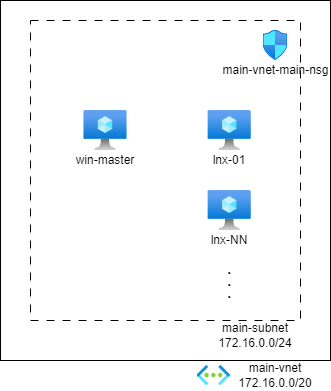

# 複数 JMeter を使った負荷掛け環境

## 構築する環境



管理用Windowsサーバー（master）、リクエスト送信するLinuxサーバー（slave）を構築。
リクエスト送信するLinuxサーバーは複数台作成可能で、台数は指定できる。
送信したいリクエスト数に応じて増減させる（サブネットが足りなければ増やして利用）。

## 環境構築方法

環境は terraform で展開する。
terraform ファイルは `/infra` にある。

1. 設定ファイルの準備

    1. `/infra/terraform.tfvars` を作成

        ```
        # Tenant, Subscription Configuration
        TENANT_ID       = "00000000-0000-0000-0000-000000000000"
        SUBSCRIPTION_ID = "11111111-1111-1111-1111-111111111111"

        # Resouce Configuration
        location   = "japaneast"
        prj        = "x-jmeter"
        env        = "test"
        mastername = "win-master"
        slavename  = "lnx-slave"
        slavecount = 1
        username   = "azureuser"
        password   = "<YOUR-LOGIN-PASSWORD>"
        ```

        |変数名|値|
        |---|---|
        | `TENANT_ID` | 展開したいAzureテナントID。 |
        | `SUBSCRIPTION_ID` | 展開したいAzureサブスクリプションID。 |
        | `location` | 展開したいリージョン名。例： `japaneast` |
        | `prj` | プロジェクト名。任意文字列。例： `x-jmeter` |
        | `env` | 環境名。任意文字列。例： `test` |
        | `mastername` | マスターサーバーの名前。例： `win-master` |
        | `slavename` | スレーブサーバーの名前。例： `lnx-slave` |
        | `slavecount` | スレーブサーバー台数。例：　`3` |
        | `username` | サーバーのログインユーザー名。例： `azureuser` |
        | `password` | サーバーのログインパスワード。 |

1. Azure 上へ展開
    1. ターミナルを立ち上げて `/infra` フォルダへ移動

        ```
        cd infra
        ```

    1. 初期化

        ```
        terraform init
        ```

    1. Azureへログイン

        ```
        az login
        az account set -s <YOUR-SUBSCRIPTION-ID>
        ```

    1. 展開実施

        ```
        terraform apply -auto-approve
        ```

1. 管理サーバーの設定

    1. 管理サーバーへログイン

    1. 管理者権限で `/infra/vm-master-cloud-init.ps1` を実行

        以下の場所へ JMeter がインストールされる

        `$env:USERPROFILE\bin\jmeter`

    1. リクエスト送信するLinuxサーバーアドレスを設定

        `$env:USERPROFILE\bin\jmeter\bin\jmeter.properties` を開いて作成した台数分、以下のように設定

        ```
        ・・・（省略）・・・
        remote_hosts=172.16.1.4,172.16.1.5,172.16.1.6
        ・・・（省略）・・・
        ```


## 使い方

1. JMeter の起動

    以下のファイルを実行することで起動

    `$env:USERPROFILE\bin\jmeter\bin\jmeter.bat`

1. スレーブサーバーを使った実行

    [Run]-[Remote Start] から接続先を選択して動作確認


